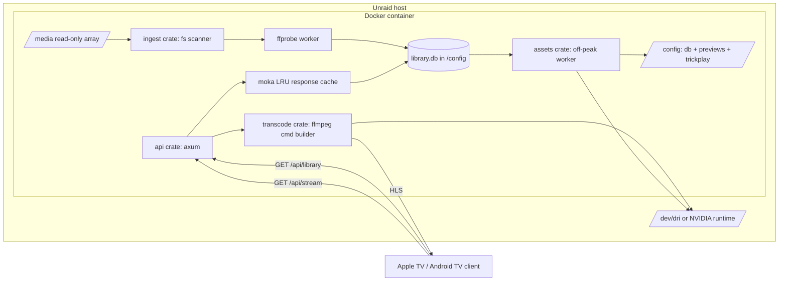

# 00 — Architecture & Repository Structure

> Cross-cutting task. Read this first. It defines the system shape, the directory
> layout ("where to save things"), the `/config` vs `/media` contract, and how the
> system scales. Every phase file assumes the structure defined here.

## Purpose

`medi` is an open-source, single-node, high-performance media library manager that
ingests, organizes, and streams a 3,000–10,000 item library of large video assets
(H.264/AVC, HEVC/H.265, AV1, 1080p, 4K HDR10/HDR10+/HLG, Dolby Vision P5/P7/P8).
It transcodes on the fly with GPU hardware acceleration (Intel QSV, NVIDIA NVENC,
AMD AMF/VA-API), serves a unified Apple TV + Android TV client, and ships as a Docker
image installable on Unraid via a Community Applications XML template.

**Out of scope (intentional):** user authentication, multi-user watch state, cloud
sync. This is a frictionless LAN-first appliance. Do not add auth without a spec change.

## Requirements

- Backend must return catalog data with near-zero latency for grids of up to 10,000 items.
- Backend is **Rust** (axum + tokio async runtime).
- Persistence is **embedded SQLite** — a single `library.db` file (see `01-db-schema.md`).
- Metadata extraction and all transcoding are **subprocess** calls to `jellyfin-ffmpeg`
  / `ffprobe` (no libav FFI) — see `20-phase2-hwa-transcode.md`.
- Preview/trickplay assets are pre-generated by a background worker, never live-transcoded.
- Client is a single TypeScript codebase (Expo + react-native-tvos) targeting both TV OSes.

## System data flow



## Repository / directory layout — where to save things

```
medi/
├── docs/
│   ├── README.md              # architectural blueprint (source of truth, narrative)
│   ├── spec.md                # condensed package + roadmap summary
│   └── .tasks/                # THESE task files
├── backend/                   # Rust cargo workspace (the whole server)
│   ├── Cargo.toml             # [workspace] members = crates/*
│   ├── crates/
│   │   ├── api/               # axum server, routers, DTOs — see 02-api-contract.md
│   │   ├── db/                # rusqlite + r2d2 pool, PRAGMAs, migrations, models
│   │   ├── ingest/            # filesystem scanner + ffprobe metadata worker
│   │   ├── transcode/         # ffmpeg command builder, HWA vendor paths, HLS sessions
│   │   ├── assets/            # off-peak preview-clip + trickplay-sprite worker
│   │   └── core/              # shared types (MediaProfile, DvProfile enum), config, errors
│   ├── migrations/            # SQL migration files (embedded via refinery)
│   └── tests/                 # integration tests + sample media fixtures metadata
├── client/                    # Yarn workspaces monorepo (Expo react-native-tvos + web)
│   ├── package.json           # "workspaces": ["apps/*", "packages/*"]
│   ├── apps/
│   │   ├── tv/                # the TV app (Expo CNG target: appleTV + androidTV)
│   │   └── web/               # browser SPA (Vite + React DOM), served by the binary at / — see 80-web-ui-client.md
│   └── packages/
│       ├── ui/                # shared components: PosterGrid, Carousel, HoverPreview
│       ├── navigation/        # react-tv-space-navigation setup, focus traps, guides
│       ├── player/            # react-native-video wrapper + useTVEventHandler overlay
│       └── api-client/        # typed fetch client generated from 02-api-contract.md
├── docker/
│   ├── Dockerfile             # multi-stage Debian build (see 50-phase5)
│   └── entrypoint.sh          # applies PRAGMAs / migrations on boot, launches server
└── unraid-templates/          # (may also live in a separate GitHub repo)
    ├── medi.xml               # Unraid CA template
    └── ca_profile.xml         # maintainer profile + support links
```

> **Backend crate boundaries matter.** `core` holds the shared `DvProfile`/`MediaProfile`
> types that flow schema → ingest → transcode → api. Do not duplicate these enums per crate.

> **The binary serves a browser UI at `/`** (`80-web-ui-client.md`). The same `api` crate that
> serves `/api/*` also serves the built `client/apps/web` SPA via a static fallback, on the
> same port (`0.0.0.0:8096`). The web assets ship **in the image** at `/usr/share/medi/web`
> (`AppConfig::web_dir`), never under `/config` or `/media` — see the contract below.

## The `/config` vs `/media` contract (used by every phase)

| Path       | Mount            | Access     | Holds                                                        |
|------------|------------------|------------|-------------------------------------------------------------|
| `/media`   | Unraid array     | Read-only  | The user's source video files. **Never written to.**        |
| `/config`  | appdata cache    | Read-write | `library.db`, WAL files, generated preview clips, trickplay sprites, logs |

- `/config/library.db` — SQLite database.
- `/config/previews/<file_id>.mp4` — 720p silent hover clips.
- `/config/trickplay/<file_id>.{bif,jpg}` — scrub sprites.
- Every phase that writes generated assets writes under `/config`, never `/media`.

## Scaling levers (how to scale)

- **WAL mode** (`journal_mode=WAL`) — unlimited concurrent readers + one writer, so a
  background scan never blocks catalog reads during playback. Set in `01-db-schema.md`.
- **64 KB page size** (`page_size=65536`) — aligns reads with NVMe geometry, shallower
  B-tree. Must be set **before** the first table is created (it is a one-time-at-create
  pragma); the migration runner must apply it on a fresh DB.
- **`mmap_size` + `cache_size`** — memory-map the DB and grow the page cache so hot
  catalog pages live in RAM; leaves headroom for OS page cache and transcode buffers.
- **moka LRU response cache** in the `api` crate — serialized JSON catalog responses are
  cached and served in microseconds; invalidated on ingest write. Sized by item count.
- **r2d2 connection pool** — bound pool size to a small multiple of CPU cores; rusqlite is
  synchronous, so DB calls run on tokio's blocking thread pool (`spawn_blocking`).
- **Off-peak asset worker throttle** — the `assets` crate runs only inside a configurable
  window and yields the GPU to live transcode sessions (GPU-idle guard) — see `30-phase3`.

## Verification

- Repo tree matches the layout above; `cargo metadata` lists all workspace crates.
- `docs/README.md` roadmap Phase N ↔ `docs/.tasks/N0-phaseN-*.md` (1:1).
- The `/config` vs `/media` table is referenced identically in `01`, `30`, and `50`.
